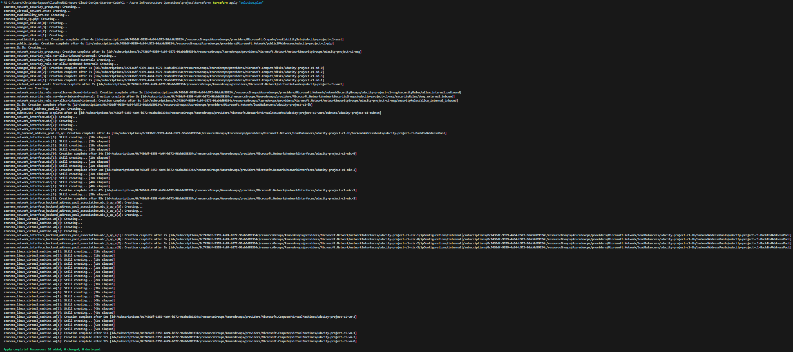

# Azure Infrastructure Operations Project: Deploying a scalable IaaS web server in Azure

### Introduction
For this project, you will write a Packer template and a Terraform template to deploy a customizable, scalable web server in Azure.

### Getting Started
1. Clone this repository https://github.com/juppgo/nd082-Azure-Cloud-DevOps-Starter-Code.git

2. Create your infrastructure as code

3. Update this README to reflect how someone would use your code.

### Dependencies
1. Create an [Azure Account](https://portal.azure.com) 
2. Install the [Azure command line interface](https://docs.microsoft.com/en-us/cli/azure/install-azure-cli?view=azure-cli-latest)
3. Install [Packer](https://www.packer.io/downloads)
4. Install [Terraform](https://www.terraform.io/downloads.html)

### Instructions
Here are the instructions on how to use the provided Packer and Terraform templates:

**Policy deployment**
1. Go to the portal and create a tagging policy to deny resources to be created with no tags. Take the policy.json in the policy directory as a template.

**Packer Template: server.json**

1. cd into the packer directory.
2. Make sure you have the necessary environment variables at hand:
- ARM_CLIENT_ID: Azure Service Principal Client ID
- ARM_CLIENT_SECRET: Azure Service Principal Client Secret
- ARM_SUBSCRIPTION_ID: Azure Subscription ID

3. Build the Packer image using the following command:

> packer build -var 'client_id=YOUR_ACTUAL_CLIENT_ID' -var 'client_secret=YOUR_ACTUAL_CLIENT_SECRET' -var 'subscription_id=YOUR_ACTUAL_SUBSCRIPTION_ID' server.json

This will create a managed image in your Azure subscription, which you can use in your Terraform configuration. Note down the image_id of the packer build command output to paste it into the vars.tf image_id variable. It is used to determine the packer image in the terraform deployment.

**Terraform Template**
1. Adjust the default values as per your requirements in the vars.tf. For example change the number of VMs or location.
2. cd into terraform directory.
2. Initialize the Terraform configuration:
> terraform init
3. Plan the Terraform configuration:
> terraform plan -out solution.plan
4. Apply the Terraform configuration:
> terraform apply "solution.plan"

Submit and Terraform will create the specified number of virtual machines in Azure based on the Packer image and other necessary infrastructure components.

### Output
Upon successfully running the Packer and Terraform templates, you can expect the following:
- A policy to deny deployment without tagging. 
- Packer will create a managed image in your Azure subscription.

- Terraform will create the number of virtual machines as specified in the vars.tf, based on the Packer image, a load balancer, network security groups, and other necessary infrastructure components.

**NOTE: Output might be different if you change the variables.**
- Expected plan output:

- Expected apply output:

